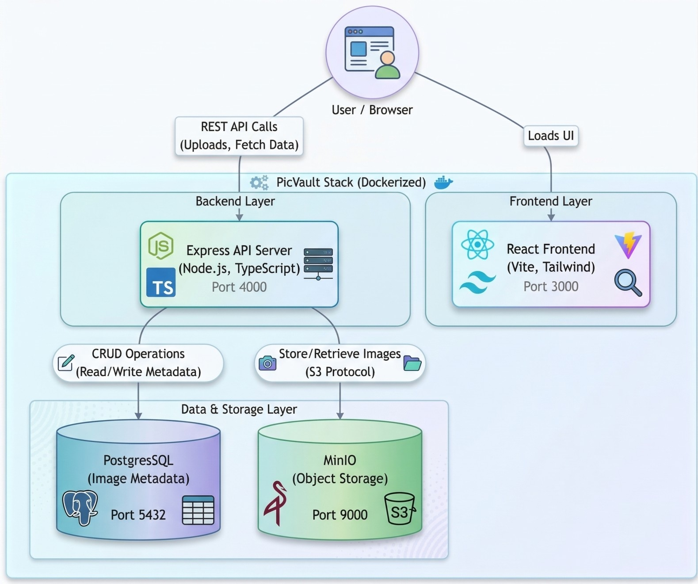
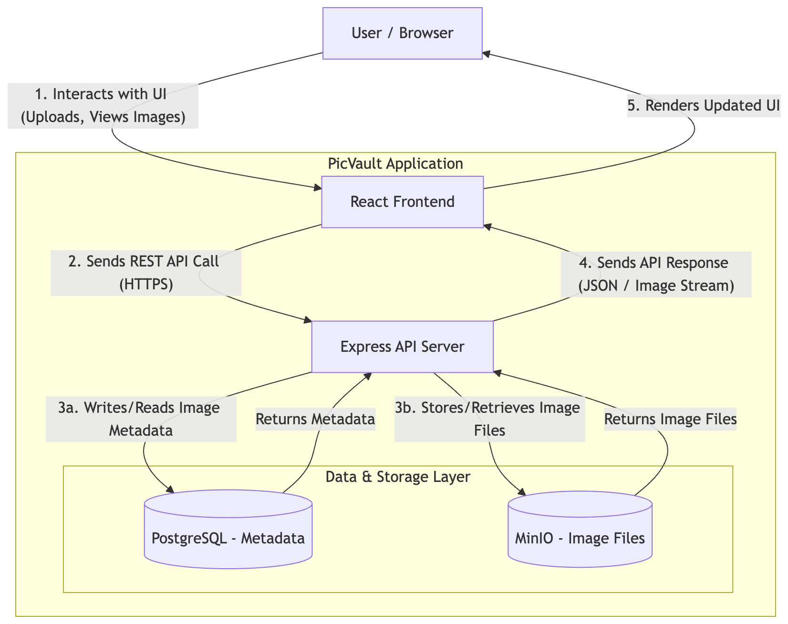

# PicVault

PicVault is a full-stack image hosting application that allows users to upload, store, and view images securely. It leverages a modern tech stack featuring React, Node.js, and MinIO for S3-compatible object storage.

## Project Overview

### Backend

- **Framework:** Node.js with Express and TypeScript.
- **Database:** PostgreSQL for metadata storage via Sequelize ORM.
- **Storage:** MinIO (S3-compatible) for high-performance object storage.
- **Features:** Multipart uploads (up to 20 files), 50MB size limits, rate limiting, and centralized error handling.

### Frontend

- **Framework:** React with TypeScript.
- **State Management:** TanStack Query (React Query) for efficient data fetching.
- **Styling:** Tailwind CSS for a responsive and modern UI.
- **Features:** Drag-and-drop uploads, image gallery with masonry layout, and real-time upload progress.

## Architecture

Below are the diagrams outlining the architecture and data flow of PicVault.

### 1. High Level Architecture



### 2. Data Flow Diagram



### 3. Sequence Diagram


## Getting Started with Docker

The easiest way to run the entire PicVault stack (Frontend, Backend, Database, and Object Storage) is using Docker Compose.

### Prerequisites

- [Docker Desktop](https://www.docker.com/products/docker-desktop/) installed.

### Running the Application

1. **Clone the repository:**

   ```bash
   git clone https://github.com/<private-repo>/picvault.git
   cd picvault
   ```

2. **Configure Environment Variables:**
   Create a `.env` file in the root directory (or ensure the `backend/` and `frontend/` directories have their respective `.env` files configured).

3. **Launch with Docker Compose:**

   ```bash
   docker-compose up --build
   ```

4. **Access the services:**
   - **Frontend:** [http://localhost:3000](http://localhost:3000)
   - **Backend API:** [http://localhost:5000](http://localhost:5000)
   - **MinIO Console:** [http://localhost:9001](http://localhost:9001)

## Development

If you prefer to run services individually for development:

### Backend

```bash
cd backend
npm install
npm run dev
```

### Frontend

```bash
cd frontend
npm install
npm start
```

## License

This project is licensed under the MIT License.
